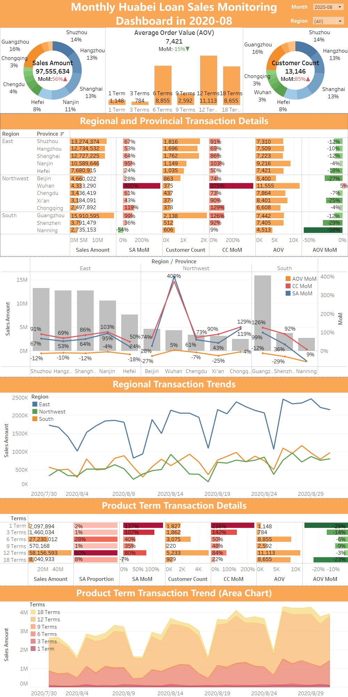

## 📊 Huabei Loan Sales Monitoring Dashboard (Tableau Version)

### Project Overview

This project uses **Tableau's data connection and cleaning features** to build a fully automated dashboard for analyzing monthly sales data of **Huabei loan installment products**. Compared to the Excel version, this version offers enhanced interactivity, real-time data refresh, and polished visualizations for monitoring trends and breakdowns.

### Key Features

- 🔗 **Live/extract connection to Excel source**, enabling automated data refresh
- 🧹 **Data cleaning and transformation** using Tableau Prep within `.twbx`
- 📈 Multi-layered **interactive dashboards**, including trends by region, product term analysis, and customer metrics
- 🌍 Includes **both English and Chinese versions** of the dashboard file

### File Descriptions

| Filename                     | Description                                                  |
| ---------------------------- | ------------------------------------------------------------ |
| `MonitoringDashboard.twbx`   | English version Tableau workbook (data cleaning + dashboard) |
| `花呗借贷销售监控表.twbx`    | Chinese version Tableau workbook (same structure, localized labels) |
| `ScreenshotDashboard_cn.jpg` | Chinese dashboard preview                                    |
| `ScreenshotDashboard_en.jpg` | English dashboard preview                                    |
| `ScreenshotTableau_cn.jpg`   | Tableau Editor view (Chinese)                                |
| `ScreenshotTableau_en.jpg`   | Tableau Editor view (English)                                |

### Main Visual Components

- ✅ **Regional and Provincial Transaction Details**
- 📈 **Regional Transaction Trends (Line Chart)**
- 📊 **Product Term Analysis (Bar & Area Charts)**
- 📌 **Sales KPIs**: total amount, customer count, ATV, and MoM growth

### Preview Screenshots

#### English Dashboard Preview

#### English Editor Preview

### 🚀 How to Use

1. Install Tableau Desktop (version 2021.4 or later recommended)
2. Open either `.twbx` file (choose one below):
    - `MonitoringDashboard.twbx` (English version)
    - `花呗借贷销售监控表.twbx`（中文版）
3. If prompted, relink to the local Excel data source
4. Explore dashboards and use filters/slicers to view by region, term, or date

See Chinese README.md at [中文版](README_cn.md)
