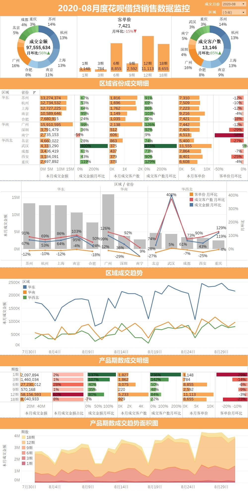
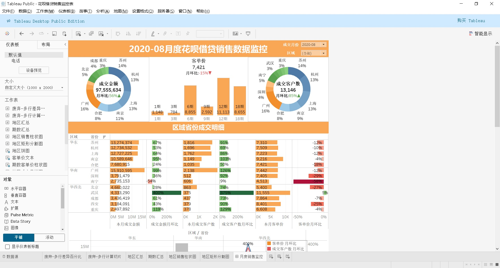

## 📊 花呗借贷销售监控仪表板（Tableau 版本）

### 项目简介

本项目基于 Tableau 的数据连接和清洗功能，构建了一个自动化的花呗借贷类产品月度销售数据监控仪表板，实现从原始数据导入、清洗处理到可视化分析的全流程。相比 Excel 版本，本项目进一步提升了交互性与可视化美观度，适用于销售趋势监控与区域/产品期数细分分析。

### 项目亮点

- 🔗 使用 Tableau 的**数据连接与自动更新机制**，支持从原始 Excel 数据源自动提取与刷新
- 🧹 应用 Tableau 的**数据预处理（Data Preparation）与清洗逻辑**
- 📈 构建多视图交互仪表板，包括区域销售趋势、产品期数趋势、成交客户分析等
- 🌐 提供中英文双语版本 `.twbx` 文件，适应不同使用场景

### 文件说明

| 文件名                       | 说明                                          |
| ---------------------------- | --------------------------------------------- |
| `MonitoringDashboard.twbx`   | 英文版 Tableau 仪表板（含数据清洗和可视化）   |
| `花呗借贷销售监控表.twbx`    | 中文版 Tableau 仪表板（含数据清洗和可视化）   |
| `ScreenshotDashboard_cn.jpg` | 中文仪表板整体预览图                          |
| `ScreenshotDashboard_en.jpg` | 英文仪表板整体预览图                          |
| `ScreenshotTableau_cn.jpg`   | 中文 Tableau 编辑视图截图（含字段与清洗流程） |
| `ScreenshotTableau_en.jpg`   | 英文 Tableau 编辑视图截图（含字段与清洗流程） |

### 主要功能视图

- ✅ 区域&省份维度的成交明细（带交互筛选器）
- 📈 区域成交趋势折线图
- 📊 产品期数成交结构分析（柱状图 + 面积图）
- 🧾 成交金额、客户数、客单价、环比变化等指标总览

### 截图预览

#### 中文仪表板预览

#### 中文Tableau界面预览

### 🚀使用方法

1. 安装Tableau Desktop (version 2021.4 - 2024.3)

2. 通过Tableau打开.twbx文件
  * 花呗借贷销售监控表.twbx（中文版）
  * MonitoringDashboard.twbx (English version)

3. 通过修改月份、区域或点击条形图中的期数来生成对应的看板
